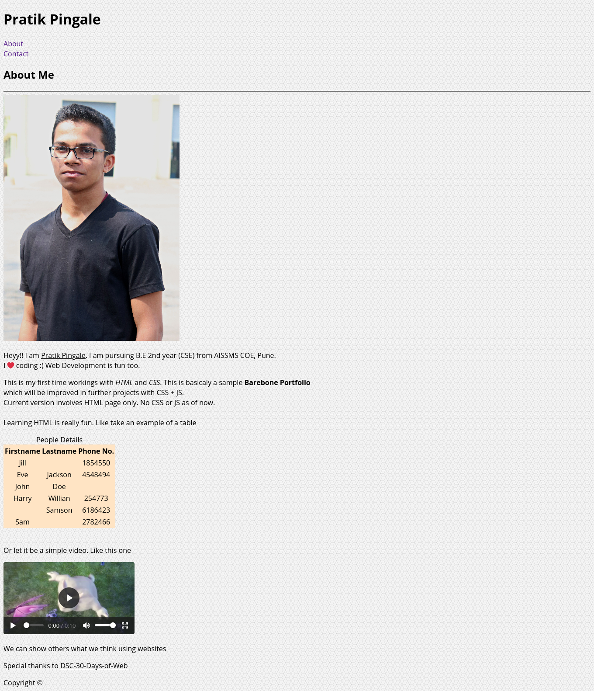

# Project 1: HTML Project (Barebones Portfolio)

### Create a barebones HTML portfolio website of your own using the following features:

* Header
* Footer
* Contact form with **buttons, email input, number input, first name and last name**
* Table
* Video
* Images

---

## Main page

---

## Contact page

